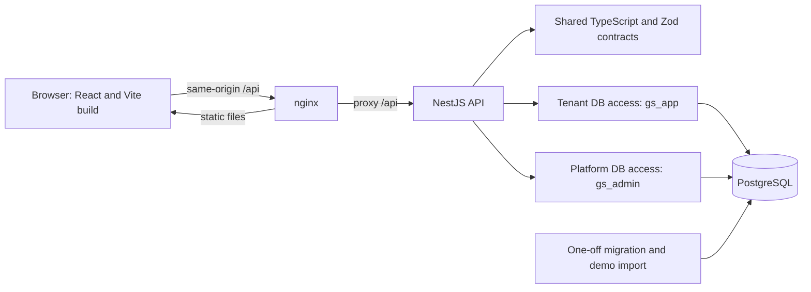

# Architecture

GreenState is one modular web/API application backed by PostgreSQL. The [README architecture section](../README.md#architecture) gives the short summary; this page identifies the runtime boundaries and their source locations.

The arrow from nginx to the browser denotes static-file delivery; the browser sends API requests to nginx. Compose starts PostgreSQL, completes the one-off migration/import service, then starts the API and web containers. It runs one API instance. There are no background workers.

## Code map

| Responsibility | Source |
| --- | --- |
| Browser routes, role-gated pages, and post-auth destinations | [router.tsx](../apps/web/src/app/router.tsx), [auth-destination.ts](../apps/web/src/features/auth/auth-destination.ts), [features](../apps/web/src/features/) |
| Tenant branding and browser titles | [brand-colors.ts](../apps/web/src/app/brand-colors.ts), [PageTitle.tsx](../apps/web/src/app/PageTitle.tsx) |
| Browser API calls and server-state boundaries | [api.ts](../apps/web/src/lib/api.ts), [query-client.ts](../apps/web/src/app/query-client.ts), [AccountBoundary.tsx](../apps/web/src/app/AccountBoundary.tsx) |
| API composition and HTTP setup | [app.module.ts](../apps/api/src/app.module.ts), [bootstrap.ts](../apps/api/src/bootstrap.ts) |
| Request/response validation shared by web and API | [contracts](../packages/contracts/src/) |
| Tenant-scoped and privileged database access | [tenant-db.ts](../apps/api/src/db/tenant-db.ts), [admin-db.ts](../apps/api/src/db/admin-db.ts) |
| Schema, migrations, local database roles | [schema.prisma](../apps/api/prisma/schema.prisma), [migrations](../apps/api/prisma/migrations/), [roles.sql](../infra/db/roles.sql) |
| Containers, proxy, and CI | [compose.yaml](../compose.yaml), [nginx config](../apps/web/nginx.conf), [CI](../.github/workflows/ci.yml) |

The API groups controllers, services, and repositories by feature: tenants, listings, availability, bookings, saved listings, identity, and platform administration. The browser likewise groups portal, saved, host, auth, and admin screens by feature. Shared Zod schemas validate external input; API DTOs are mapped explicitly instead of returning arbitrary database objects.

## Identity and tenant boundary

The URL slug resolves the public tenant. Tenant accounts are unique within a tenant; the same email may represent distinct accounts in different portals. A platform administrator signs in through a separate `/admin` realm and cookie. Server-side session and permission guards authorize private routes; hiding a button in the browser is not the authorization boundary.

Ordinary API work uses the restricted `gs_app` database role. [TenantDb](../apps/api/src/db/tenant-db.ts) sets the tenant ID for each transaction, and sets the user ID for saved-list ownership. Migrations enforce forced row-level security on tenant tables; saved listings require both tenant and owner context. Composite foreign keys prevent child rows from pointing to listings or users in another tenant. The admin module receives a separate `gs_admin` pool for platform operations. Both credentials live in the same API process, so these database roles constrain ordinary queries but do not isolate a fully compromised process. See [data model](data-model.md) and [security maintenance](security-maintenance.md).

## Dates, writes, and lifecycle

Availability uses tenant business dates and half-open stays: check-in is included, checkout is excluded. Noncancelled bookings and manual blocked days make nights unavailable; booking records are read-only in this application. A host edit or calendar write is checked server-side against current state. Listing versions reject stale edits. Coordinated writes acquire a shared live-tenant lock and relevant listing lock; tenant deletion and timezone changes take the exclusive tenant lock. Portfolio calendar reads use a repeatable-read snapshot to keep the displayed rows and totals consistent.

Tenant deletion and listing archiving retain historical data. Deleted tenants cease serving their portal and accepting writes; their slugs remain reserved. Archived listings leave public results but remain available to hosts and remain referenced by bookings and saved entries. Import completion is versioned and checksummed so a later Compose start does not overwrite edits. The detailed paths are in [flows](flows.md).
