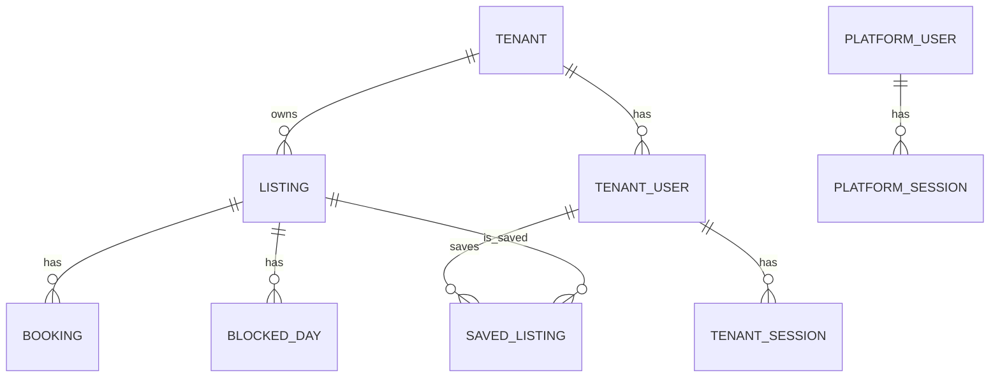

# Data model and invariants

The authoritative schema is [Prisma's schema](../apps/api/prisma/schema.prisma); database migrations also contain row-level security, grants, and constraints. This is a review map of the main relationships.

`SeedRun` is a separate import ledger holding version, checksum, counts, and completion time. Platform users are not children of a tenant. Tenant configuration includes unique slug, name, business timezone, optional primary color and contact email, and an optional deletion timestamp.

## Boundaries and keys

- Listings and tenant users carry `tenant_id`. Bookings and blocked days refer to a listing by `(listing_id, tenant_id)`, preventing a child row from naming a listing in another tenant. Saved listings reference both a tenant user and listing using the same tenant ID.
- A tenant user email is unique within a tenant, not globally. A saved entry is unique by `(tenant_id, user_id, listing_id)`. A manual blocked day is unique by `(listing_id, date)`.
- Tenant sessions and platform sessions are separate tables. They store a hash of the opaque token, not the raw cookie token.
- The ordinary runtime role is subject to forced tenant row-level security. Saved-list policies additionally require the current user ID. The platform admin uses a separate privileged role and guarded API routes. See [architecture](architecture.md#identity-and-tenant-boundary).

## Availability and lifecycle rules

- Booking and search ranges are **`[checkIn, checkOut)`**: checkout does not occupy its date. Cancelled bookings occupy no nights. A manual blocked day occupies its date. Tenant business timezone determines “today” for host edits; listing cities do not set their own timezone.
- Booking status imported from CSV is retained as supplied. A displayed past/current/upcoming period is computed from dates and is separate from that status. Booking rows are read-only in the app.
- `archived_at` hides a listing publicly while retaining host access, bookings, blocks, and saved-list references. `deleted_at` disables a tenant portal and future writes while retaining rows and reserving its slug. Neither action hard-deletes history.
- Listing `version` enables optimistic conflict checks for edits and archive/restore. Write transactions combine tenant and listing locks where required. Portfolio calendar reads use a repeatable-read snapshot; ordinary transaction isolation is read committed.

The [availability implementation](../apps/api/src/availability/availability.ts), [tenant database wrapper](../apps/api/src/db/tenant-db.ts), and [schema migrations](../apps/api/prisma/migrations/) are useful places to verify these rules in code.
